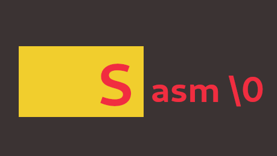

### Sasm ###

----
This is Sasm - a stack based, assembly-like language that aims to target a wide variety of virtual machines.

Design goals:
- Trust the programmer
- Keep the language as simple as possible
- Keep the standard library as minimal as possible
- One pays for only as much as one wants to do

What Sasm will *never* have:
- Automatic memory management
- Implicit safety checks; everything has to be done explicitly by the programmer

The reference implementation of Sasm that I've been working on is called MSasm.

MSasm can currently target:
- STVM

In the future MSasm will be able to target:
- WebAssembly
- CIL
- JVM

A simple Hello World program written in a standard compliant implementation of Sasm 1):

    import "./lib/import/io.sah"
    :string dat str "Hello, World!\n"
    :main
    pushu8 0 str0
    call std_io_init ;loads the `std_io' library
    
    pushi64 string ptr_data
    pushu8 0 pushu8 0 str1 str0
    call std_io_puts ;call the `puts' function from `std_io'
    
    hlt

1)Check out more examples in the `examples` directory in this repository.

A formal language specification is extremely important for the development of a language, and Sasm has a (WIP) standard too. You'll be able to find a standard draft of this language in this repository in a month or two.

PS: You'll also be able to find the source of the reference implementation of Sasm that I've been working on in this repository soon.

PPS: Check out the Sasm website [here](https://trap-representation.github.io/Sasm/).
