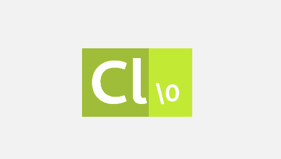

Chlore
----



This is Chlore - a stack based, assembly-like language that's made with a focus on speed and simplicity.

#### Why yet another new language? ####

1. Most of the modern languages are built with memory-safety in mind. But let's be honest, a compiler can never be perfect; it's not hard for subtle bugs to slip through and cause all sorts of weird stuff.

   This is why Chlore does *not* try to be memory-safe at all. It is built with a focus on speed and optimizations, rather than memory-safety. It's always better to make the programmer aware that they're programming in a "memory-unsafe" language, rather than give them a false sense of safety.

2. Languages are slowly turning into a bloated mess:
- Huge standard libraries with "features" to make programmers' lives easier
- Package managers built right into the language encouraging the use of third-party libraries (which is one of the main causes of security vulnerabilities in softwares, since programmers don't care to read the source of the library they're using)
- Some languages don't even have any formal specification

   Chlore does not and will *never* have any of these "features". Chlore follows a spec-first approach for the design of the language and it has a standard library that tries to be small, lightweight, and as close to libc as possible.

3. Modern languages aren't simple anymore. Simplicity isn't always proportional to how much a language can make a programmer's life easier. A simple language should be small, lightweight, and efficient. The programmer shall be the one in full control of his code, rather than the compiler.

#### Design goals: ####
- Trust the programmer
- Keep the language as simple as possible
- Keep the standard library as minimal as possible
- One pays for only as much as one wants to do

#### What Chlore will *never* have: ####
- Automatic memory management
- Run-/Compile-time memory-safety checks; everything has to be done explicitly by the programmer

The reference implementation of Chlore that I've been working on is called MChlore.

#### MChlore can currently target: ####
- STVM

#### In the future MChlore will be able to target: ####
- SUBLEQ
- WebAssembly
- CIL
- JVM

#### A simple Hello World program written in a standard compliant implementation of Chlore: ####

````
import "./lib/import/io.sah"
import "./lib/import/porttypes.sah"

:string dat str "Hello, World!\n"

:main
;register the library that we need to use
%pushuc 0
%reg_std_io

;register the symbol from the library that we are going to need
%pushuc 0 %pushuc 0
%reg_std_io_putstr

;invoke the registered symbol
%pushp string ptr_data
%pushuc 0 !
hlt
````

#### Future plans: ####
- Build a useful standard library
- Build a compiler for a higher-level language that will be able to target Chlore
- Make MChlore self-hosted
