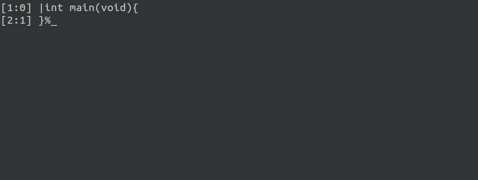

Chlore
----


This is Chlore - a stack based language that's made with a focus on simplicity.

#### Why yet another new language? ####

1. Most of the modern languages are built with memory-safety in mind, and implementations have to perform a lot of complex operations to "guarantee" that "memory-safety" they promise. But let's be real here - the more complex the implementation is, the more are the chances of subtle bugs to silp right through, and cause all sorts of weird stuff.

    Chlore implementations are *not* required to provide "memory-safety", and its reference implementation is probably one of the simplest compilers you'll find out there.

2. Languages are slowly turning into a bloated mess:
- Huge standard libraries with "features" to make programmers' lives easier
- Package managers built right into the language encouraging the use of third-party libraries (which is one of the main causes of security vulnerabilities in softwares, since most programmers don't care to read the source of the library they're using)
- Some languages don't even have any specification

   Chlore does not and will *never* have any of these "features". Chlore follows a spec-first approach for the design of the language and it has a standard library that tries to be small.

3. Modern languages aren't simple anymore. Simplicity isn't always proportional to how much a language can make a programmer's life easier. A simple language should be ... well, simple. It must not be unnecessarily complicated to define and implement.

#### What I use Chlore for ####

About everything I do nowadays, which includes, but is not limited to: compiler development, implementing emulators, and sometimes writing my own utilities instead of downloading random stuff off the internet. Heck, even the text editor I use now ([YET](https://github.com/trap-representation/YET)) is written in Chlore. Here's a GIF of the YET text editor in action:


#### A simple Hello World program written in a standard compliant implementation of Chlore: ####

````
import "stdlib.chlore"
import "io.chlore"

:main
  pushp "Hello, World!\n"
  pushp putstr call
  hlt
````

#### A summary of the syntax of Chlore: ####

````
[Notation]:

A colon (:) following a non-terminal introduces its definition. Terminals are enclosed in backticks (`). Alternative definitions are listed on separate lines, except when prefaced by the words "one of". An optional symbol is indicated by the suffix " (opt)".

----

[Lexical grammar]:

token:
  keyword
  punctuator
  identifier
  constant

keyword: one of
    `addc` `addi` `addl` `addp`
    `adds` `adduc` `addui` `addus`
    `alignc` `aligni` `alignl` `alignof`
    `alignp` `aligns` `alignuc` `alignui`
    `alignus` `aloadc` `aloadi` `aloadl`
    `aloadp` `aloads` `aloaduc` `aloadui`
    `aloadus` `andc` `andi` `andl`
    `ands` `anduc` `andui` `andus`
    `astorec` `astorei` `astorel` `astorep`
    `astores` `astoreuc` `astoreui` `astoreus`
    `c` `call` `copy` `decsp`
    `divc` `divi` `divl` `divs`
    `divuc` `divui` `divus` `dup`
    `exit` `exposed` `force_panic` `get0`
    `get1` `get2` `get3` `get4`
    `get5` `get6` `get7` `hidden`
    `hlt` `hltr` `i` `import`
    `include` `incsp` `jeq` `jge`
    `jgt` `jle` `jls` `jmp`
    `jmp_panic` `jne` `jnz` `jz`
    `l` `loadc` `loadi` `loadl`
    `loadp` `loads` `loaduc` `loadui`
    `loadus` `lshc` `lshi` `lshl`
    `lshs` `lshuc` `lshui` `lshus`
    `mulc` `muli` `mull` `muls`
    `muluc` `mului` `mulus` `nop`
    `notc` `noti` `notl` `nots`
    `notuc` `notui` `notus` `orc`
    `ori` `orl` `ors` `oruc`
    `orui` `orus` `over` `p`
    `panic` `pcopy` `pop` `popa`
    `pushc` `pushi` `pushl` `pushlt`
    `pushp` `pushs` `pushsp` `pushuc`
    `pushui` `pushus` `put` `remc`
    `remi` `reml` `rems` `remuc`
    `remui` `remus` `ret` `rshc`
    `rshi` `rshl` `rshs` `rshuc`
    `rshui` `rshus` `s` `set`
    `sizeof` `storec` `storei` `storel`
    `storep` `stores` `storeuc` `storeui`
    `storeus` `struct` `subc` `subi`
    `subl` `subp` `subs` `subuc`
    `subui` `subus` `swap` `uc`
    `ui` `us` `valoadc` `valoadi`
    `valoadl` `valoadp` `valoads` `valoaduc`
    `valoadui` `valoadus` `vastorec` `vastorei`
    `vastorel` `vastorep` `vastores` `vastoreuc`
    `vastoreui` `vastoreus` `vget0` `vget1`
    `vget2` `vget3` `vget4` `vget5`
    `vget6` `vget7` `vloadc` `vloadi`
    `vloadl` `vloadp` `vloads` `vloaduc`
    `vloadui` `vloadus` `vstorec` `vstorei`
    `vstorel` `vstorep` `vstores` `vstoreuc`
    `vstoreui` `vstoreus` `vwrite0` `vwrite1`
    `vwrite2` `vwrite3` `vwrite4` `vwrite5`
    `vwrite6` `vwrite7` `write0` `write1`
    `write2` `write3` `write4` `write5`
    `write6` `write7` `xorc` `xori`
    `xorl` `xors` `xoruc` `xorui`
    `xorus`

type:
  `c` `i` `l` `p`
  `s` `uc` `ui` `us`

decimal-digit: one of
  `0` `1` `2` `3`
  `4` `5` `6` `7`
  `8` `9`

decimal-constant:
  decimal-digit
  decimal-digit decimal-constant

octal-digit: one of
  `0` `1` `2` `3`
  `4` `5` `6` `7`

octal-digit-sequence:
  octal-digit
  octal-digit octal-digit-sequence

octal-constant:
  `0o` octal-digit-sequence

hexadecimal-digit: one of
  `0` `1` `2` `3`
  `4` `5` `6` `7`
  `8` `9` `a` `b`
  `c` `d` `e` `f`
  `A` `B` `C` `D`
  `E` `F`

hexadecimal-digit-sequence:
  hexadecimal-digit
  hexadecimal-digit hexadecimal-digit-sequence

hexadecimal-constant:
  `0x` hexadecimal-digit-sequence

binary-digit: one of
  `0` `1`

binary-digit-sequence:
  binary-digit
  binary-digit binary-digit-sequence

binary-constant:
  `0b` binary-digit-sequence

numeric-constant:
  decimal-constant
  octal-constant
  binary-constant
  hexadecimal-constant

constant:
  numeric-constant
  string-constant
  char-constant

char-constant:
  `'` character-sequence-char (opt) `'`

character-sequence-char:
  character-char
  character-char character-sequence-char

character-char:
  any member of the source character set except the `'`, the `\` character, and the newline character
  escape-sequence

string-constant:
  `"` character-sequence-string (opt) `"`

character-sequence-string:
  character-string
  character-string character-sequence-string

character-string:
  any member of the source character set except the `"`, the `\` character, and the newline character
  escape-sequence

escape-sequence:
  `\` escape-character

escape-character:
  any member of the source character set

identifier:
  identifier-nondigit character-sequence-identifier (opt)

character-sequence-identifier:
  character-identifier
  character-identifier character-sequence-identifier

identifier-nondigit: one of
  `a` `b` `c` `d`
  `e` `f` `g` `h`
  `i` `j` `k` `l`
  `m` `n` `o` `p`
  `q` `r` `s` `t`
  `u` `v` `w` `x`
  `y` `z` `A` `B`
  `C` `D` `E` `F`
  `G` `H` `I` `J`
  `K` `L` `M` `N`
  `O` `P` `Q` `R`
  `S` `T` `U` `V`
  `W` `X` `Y` `Z`
  `_` `^` `@` `|`
  `\` `[` `]` `(`
  `)` `,` `#` `{`
  `}` `&` `%` `~`
  `*` the backtick character

character-identifier: one of
  `a` `b` `c` `d`
  `e` `f` `g` `h`
  `i` `j` `k` `l`
  `m` `n` `o` `p`
  `q` `r` `s` `t`
  `u` `v` `w` `x`
  `y` `z` `A` `B`
  `C` `D` `E` `F`
  `G` `H` `I` `J`
  `K` `L` `M` `N`
  `O` `P` `Q` `R`
  `S` `T` `U` `V`
  `W` `X` `Y` `Z`
  `0` `1` `2` `3`
  `4` `5` `6` `7`
  `8` `9` `_` `^`
  `@` `|` `\` `[`
  `]` `(` `)` `,`
  `#` `{` `}` `&`
  `%` `~` `*` the backtick character

punctuator:
  `-` `+` `$` `.`
  `!`

sign: one of
  `+` `-`

visibility:
  `hidden`
  `exposed`

instruction: one of
    `addc` `addi` `addl` `addp`
    `adds` `adduc` `addui` `addus`
    `alignc` `aligni` `alignl` `alignp`
    `aligns` `alignuc` `alignui` `alignus`
    `aloadc` `aloadi` `aloadl` `aloadp`
    `aloads` `aloaduc` `aloadui` `aloadus`
    `andc` `andi` `andl` `ands`
    `anduc` `andui` `andus` `astorec`
    `astorei` `astorel` `astorep` `astores`
    `astoreuc` `astoreui` `astoreus` `call`
    `copy` `decsp` `divc` `divi`
    `divl` `divs` `divuc` `divui`
    `divus` `dup` `exit` `force_panic`
    `get0` `get1` `get2` `get3`
    `get4` `get5` `get6` `get7`
    `hlt` `hltr` `incsp` `jeq`
    `jge` `jgt` `jle` `jls`
    `jmp` `jmp_panic` `jne` `jnz`
    `jz` `loadc` `loadi` `loadl`
    `loadp` `loads` `loaduc` `loadui`
    `loadus` `lshc` `lshi` `lshl`
    `lshs` `lshuc` `lshui` `lshus`
    `mulc` `muli` `mull` `muls`
    `muluc` `mului` `mulus` `nop`
    `notc` `noti` `notl` `nots`
    `notuc` `notui` `notus` `orc`
    `ori` `orl` `ors` `oruc`
    `orui` `orus` `over` `panic`
    `pcopy` `pop` `popa` `pushc`
    `pushi` `pushl` `pushlt` `pushp`
    `pushs` `pushsp` `pushuc` `pushui`
    `pushus` `put` `remc` `remi`
    `reml` `rems` `remuc` `remui`
    `remus` `ret` `rshc` `rshi`
    `rshl` `rshs` `rshuc` `rshui`
    `rshus` `storec` `storei` `storel`
    `storep` `stores` `storeuc` `storeui`
    `storeus` `subc` `subi` `subl`
    `subp` `subs` `subuc` `subui`
    `subus` `swap` `valoadc` `valoadi`
    `valoadl` `valoadp` `valoads` `valoaduc`
    `valoadui` `valoadus` `vastorec` `vastorei`
    `vastorel` `vastorep` `vastores` `vastoreuc`
    `vastoreui` `vastoreus` `vget0` `vget1`
    `vget2` `vget3` `vget4` `vget5`
    `vget6` `vget7` `vloadc` `vloadi`
    `vloadl` `vloadp` `vloads` `vloaduc`
    `vloadui` `vloadus` `vstorec` `vstorei`
    `vstorel` `vstorep` `vstores` `vstoreuc`
    `vstoreui` `vstoreus` `vwrite0` `vwrite1`
    `vwrite2` `vwrite3` `vwrite4` `vwrite5`
    `vwrite6` `vwrite7` `write0` `write1`
    `write2` `write3` `write4` `write5`
    `write6` `write7` `xorc` `xori`
    `xorl` `xors` `xoruc` `xorui`
    `xorus`

push-instruction: one of
  `pushi` `pushl` `pushp` `pushs`
  `pushsp` `pushuc` `pushui`

[Phrase structure grammar]:

translation-unit:
  statement-sequence (opt)

statement-sequence:
  statement
  statement statement-sequence

statement:
  keyword
  push-statement
  alignof-statement
  sizeof-statement
  set-statement
  label
  import-statement
  struct-definition
  tagged-expression
  instruction

alignof-statement:
  `alignof` type
  `alignof` struct-name

sizeof-statement:
  `sizeof` type
  `sizeof` struct-name

push-statement:
  push-instruction sign (opt) constant
  push-instruction sign (opt) symbol

set-statement:
  `set` identifier sign (opt) constant
  `set` identifier sign (opt) identifier

label:
  `:` visibility (opt) symbol

import-statement:
  `import` string-constant

include-statement:
  `include` string-constant

tag:
  identifier

symbol:
  identifier

struct-name:
  identifier

struct-tag-definition:
  type `:` tag
  struct-name `:` tag

struct-tag-definition-sequence:
  struct-tag-definition
  struct-tag-definition struct-tag-definition-sequence

struct-definition:
  `struct` struct-name struct-tag-definition-sequence (opt) `!`

tag-sequence:
  `.` tag
  `.` tag tag-sequence

tagged-expression:
  `+` struct-name tag-sequence (opt)
````
