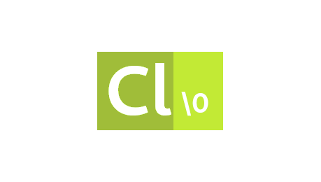

Chlore
----



This is Chlore - a stack based language that's made with a focus on simplicity.

#### Why yet another new language? ####

1. Most of the modern languages are built with memory-safety in mind, and implementations have to perform a lot of complex operations to "guarantee" that "memory-safety" they promise. But let's be real here - the more complex the implementation is, the more are the chances of subtle bugs to silp right through, and cause all sorts of weird stuff.

    Chlore implementations are *not* required to provide "memory-safety", and its reference implementation is probably one of the simplest compilers you'll find out there.

2. Languages are slowly turning into a bloated mess:
- Huge standard libraries with "features" to make programmers' lives easier
- Package managers built right into the language encouraging the use of third-party libraries (which is one of the main causes of security vulnerabilities in softwares, since most programmers don't care to read the source of the library they're using)
- Some languages don't even have any specification

   Chlore does not and will *never* have any of these "features". Chlore follows a spec-first approach for the design of the language and it has a standard library that tries to be small.

3. Modern languages aren't simple anymore. Simplicity isn't always proportional to how much a language can make a programmer's life easier. A simple language should be ... well, simple. It must not be unnecessarily complicated to define and implement.

#### What I use Chlore for ####

About everything I do nowadays, which includes, but is not limited to: compiler development, implementing emulators, and sometimes writing my own utilities instead of downloading random stuff off the internet. Heck, even the text editor I use now ([YET](https://github.com/trap-representation/YET)) is written in Chlore.

#### Cool stuff implemented in Chlore ####

1. [The YET text editor](https://github.com/trap-representation/YET)
2. [Project Euler](https://github.com/trap-representation/Project-Euler)
3. [POSIX shell utilities](https://github.com/trap-representation/posix-shell-utilities)

#### A simple Hello World program written in a standard compliant implementation of Chlore: ####

````
import "stdlib.chloreh"
import "io.chloreh"

:main
  pushp "Hello, World!\n"
  pushp putstr call
  hlt
````
